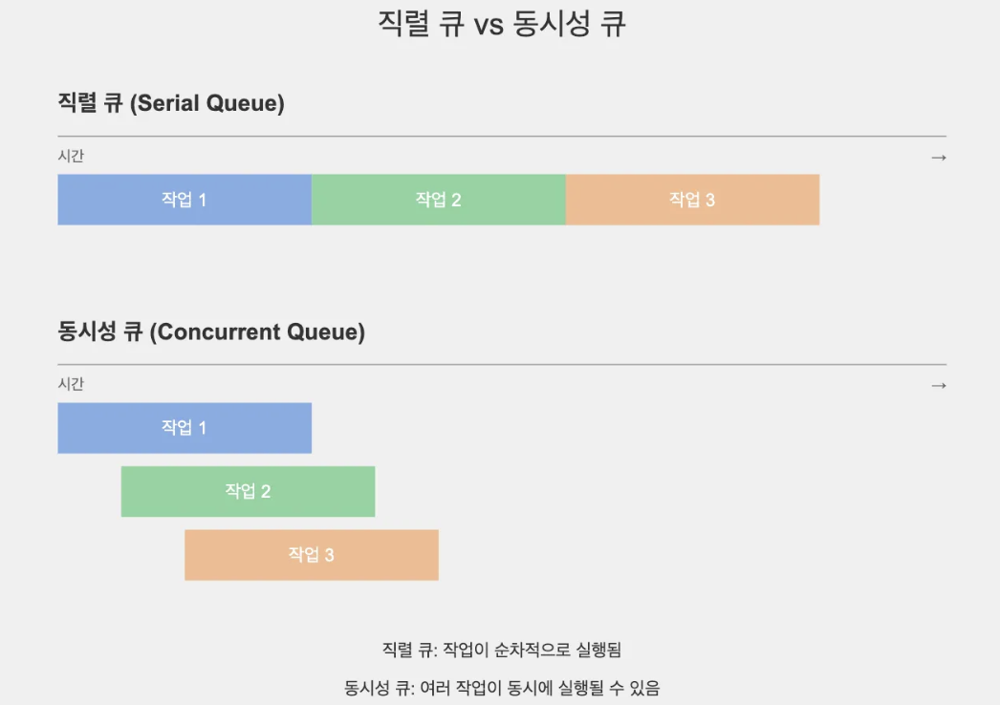

# Dispatch Queue 실습
 
```swift
DispatchQueue.{큐종류}.{qos옵션}.{sync/async} {
		// 수행할 작업 코드 작성
}
// 큐 종류: Main / Global / Custom
// qos: Quality Of Service
// sync: 동기적으로 작업 수행
// async: 비동기적으로 작업 수행
```

### DispatchQueue 종류

1. **메인 큐 (Main Queue)**
    - UI 업데이트와 관련된 작업을 처리
    - 앱의 메인 스레드에서 실행
    - Serial Queue. (직렬 큐)
2. **글로벌 큐 (Global Queue)**
    - 백그라운드 작업을 처리
    - Concurrent Queue. (동시성 큐)
3. **커스텀 큐 (Custom Queue)**
    - 개발자가 직접 생성하고 관리하는 큐
    - 직렬(Serial) 또는 동시(Concurrent) 큐로 설정 가능

### Serial vs Concurrent
  

- **Serial Queue (직렬 큐)**
    - 들어온 작업들은 한 가지 쓰레드에 모두 보내는 큐
    - 큐에 추가된 작업을 한 번에 하나씩 순서대로 실행하는 큐
    - 쓰레드 하나에 모든 작업을 할당하기 때문에 작업 완료 순서가 보장됨
- **Concurrent Queue (동시성 큐)**
    - 큐에 추가된 여러 작업을 동시에 실행할 수 있는 큐
    - 여러 스레드에서 작업이 동시에 병렬적으로 실행 가능
    - 작업의 완료 순서는 보장되지 않음

<br>

---

<br>

- MainQueue 사용
```swift
DispatchQueue.main.async {
    // UI 업데이트 코드
    self.label.text = "작업 완료!"
}
```
​
- GlobalQueue 사용
```swift
DispatchQueue.global().async {
    // 네트워크 통신 또는 계산이 무거운 작업을 백그라운드에서 수행
    let result = self.someHeavyComputation()
    
    DispatchQueue.main.async {
        // 결과를 메인 스레드에서 UI에 반영
        self.updateUI(with: result)
    }
}

```

- Custom Queue 사용
```swift
// label 에 큐의 고유한 이름 설정.
// attributes 에 serial/concurrent 설정.
// 설정하지 않으면 default 값은 serial.
let customQueue = DispatchQueue(
		label: "com.myapp.customqueue", 
		attributes: .concurrent
)

customQueue.async {
    // 커스텀 큐에서 실행할 작업
}
```

<br>

---

<br>

| level | 설명 | 사용 예 |
| --- | --- | --- |
| `.userInteractive` | 가장 높은 우선순위 | UI 반응, 애니메이션 |
| `.userInitiated` | 사용자 요청에 대한 처리 | 버튼 탭 후 작업 |
| `.default` | 기본 우선순위 | 특별한 지정 없는 일반 작업 |
| `.utility` | 오래 걸리지만 급하지 않은 작업 | 파일 저장, 다운로드 |
| `.background` | 사용자에게 보이지 않는 작업 | 캐시 정리, 백업 |


