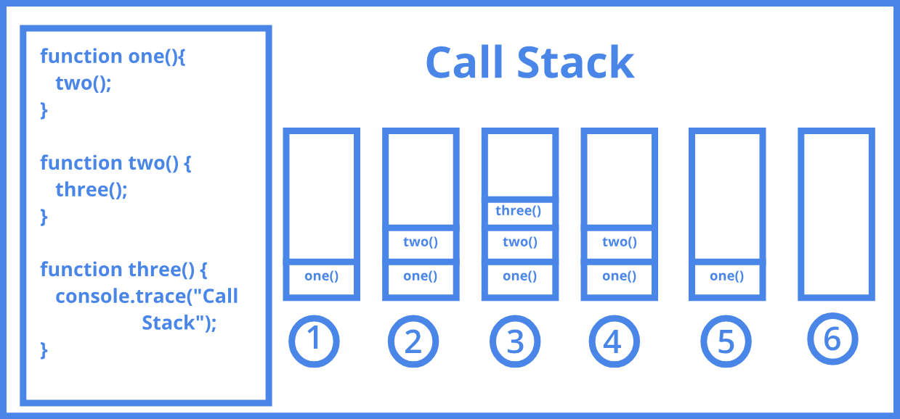
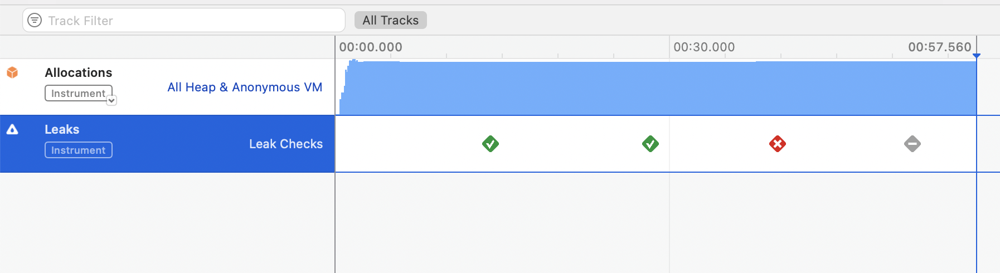
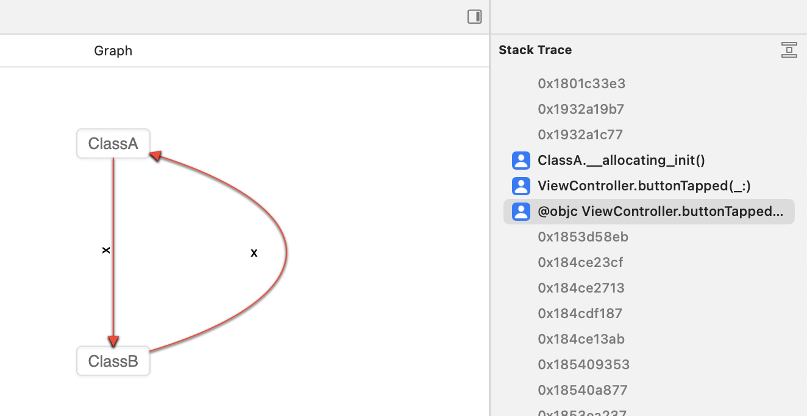
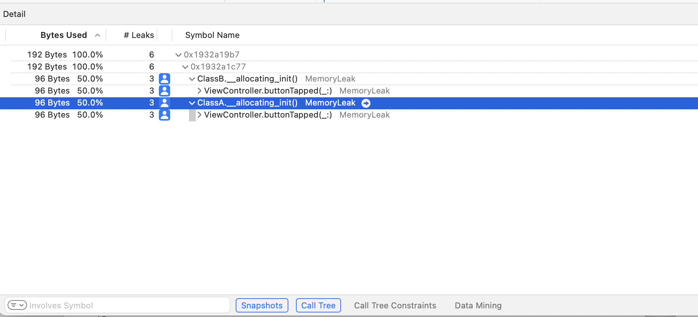

# ⚒️ Xcode Instruments, 프로파일링

### ☑️ Xcode Instruments 란 ?

- Xcode 에서 제공하는 앱의 성능 분석 및 디버깅 도구
- 앱 개발자라면 메모리 릭이 나지 않는 앱을 개발해야하므로, 메모리 릭에 대한 분석을 할 때 Xcode Instruments 활용하면 좋음
- 성능 분석, 메모리 릭 분석 가능
- 메모리 릭을 잡아내는 공부 !
- 메모리 릭 분석을 하면서 스택 트레이스 (Stack Trace)도 함께 확인 가능

 

**Stack Trace**  
- 스택(Stack)을 추적(Trace) 하다.
  

- 코드를 실행하면 스택에 쌓이면서 코드를 수행하게 된다. 이를 콜 스택(Call Stack) 이라고 한다.  
- 코드를 콜 한 순서를 알 수 있는 스택.  
- 이 스택을 뒤돌아보며 코드가 수행된 기록을 훑어보는 것을 스택 트레이스라고 함.  

 

**프로파일링**  
- 앱의 성능을 분석하고 최적화하는 과정을 프로파일링(Profile) 이라고 한다.
스택(Stack)을 추적(Trace) 하다.

---
### ⚙️ Xcode Instruments 로 메모리 누수 잡기

- 간단하게 버튼 하나를 만들고 버튼을 클릭했을 때 메모리 누수가 나도록 코드 작성
- 메모리 누수가 나는 상황은 순환 참조가 나는 상황
    
    `ClassA` ↔ `ClassB` 가 서로를 순환 참조하도록 설정

 

**Xcode Instruments 실행**  

- Product → Profile 클릭 Xcode Instruments 열림
- 초록색 체크 표시: 메모리 누수가 발생하지 않음
- 빨간색 X 표시: 메모리 누수가 발생함

 

> Leaks

  

  

> Call Tree

  
